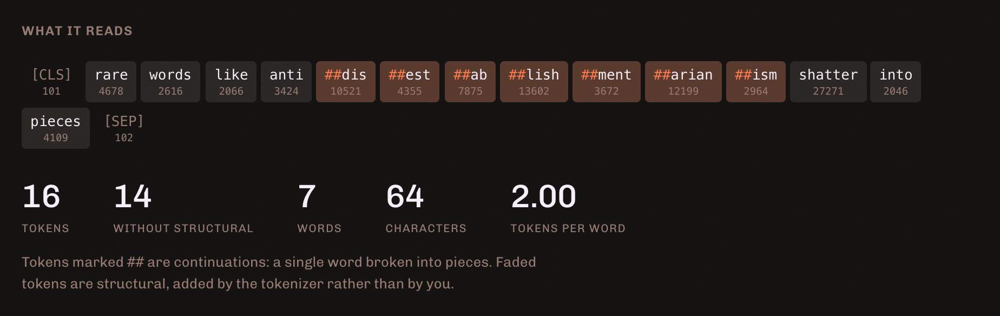
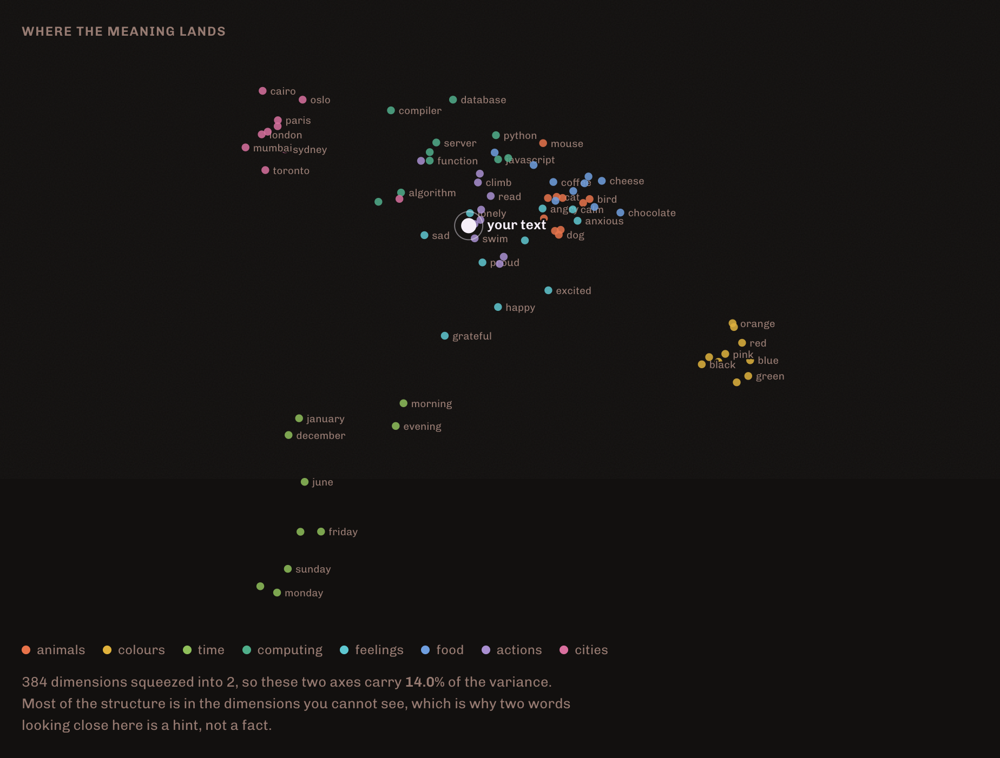

# tokenview

See what a language model actually sees. Type a sentence, watch it break into the pieces the
model reads, then watch its meaning land on a map beside eighty reference words.



**Runs entirely in your browser.** No API key, no account, no server. The model is fetched
once and cached, after which it works offline. Nothing you type leaves the page.

## What it shows

**Tokens are not words.** The panel shows every token with its id, marks continuations with
`##`, and dims the structural tokens the tokenizer adds rather than you. The counts sit
underneath: tokens, tokens without structural, words, characters, and tokens per word.

Five presets each make one point, so there is something to learn without typing anything:

| Preset | The point |
| --- | --- |
| a leading space counts | The same word costs differently depending on what precedes it |
| rare words shatter | One long word becomes many pieces. Cost is not words |
| emoji are expensive | A single glyph can be several tokens |
| numbers split oddly | Digits group by frequency, not by place value |
| case matters | Watch the ids, not the letters |

**Meaning has a shape.** Every reference word is embedded and projected to two dimensions.
Cities land together, colours land together, dates land together - and your sentence lands
somewhere among them.



That clustering is the check that the projection is honest. If related words did not group,
the map would be decoration.

## Limitations

The map says how much variance the two visible axes carry, and it is usually **under 20%**.
Two points close together in 384 dimensions will be close here, but the reverse does not
hold: the projection can flatten unrelated things onto the same spot. The percentage is
printed so you know how much to trust what you are looking at.

The tokenizer is this model's. Another model splits differently, so the counts illustrate how
tokenization behaves rather than billing a specific API.

## Determinism

A map that reshuffles between reloads teaches that position is arbitrary, which is the
opposite of the lesson. So the PCA starts from a fixed vector rather than a random one, and
each component's sign is pinned by a rule instead of by whichever way it converged.

Getting that right took three real bugs, all found by hand-computed test cases and none
visible by reading the code:

1. **On data lying exactly on a line**, the second component has zero residual variance, so
   normalising it amplified float noise into a confident-looking direction that lined up with
   the first. It now reports that there is no second component.
2. **The guard against that used an absolute threshold** below `Float32`'s noise floor, so it
   never fired. It is relative to the pre-deflation length now.
3. **Both components used the same seed.** On isotropic data the first converges to the seed,
   so the second deflated to nothing and a perfectly round cloud looked degenerate. Each
   component gets its own.

## Run it

```bash
npm install
npm run dev
```

## Tests

```bash
npm test
```

Eleven tests over the projection, none of which load a model: a straight line putting all
variance on one axis, a symmetric square splitting it evenly, a dominant axis being found,
identical output across repeated runs, no mirroring between runs, empty input, identical
points not dividing by zero, mismatched dimensions throwing, points staying inside the
viewport, and one scale across both axes so a square stays square.

## Built with

`Xenova/all-MiniLM-L6-v2` via [Transformers.js](https://huggingface.co/docs/transformers.js),
WebGPU where an adapter is really available, WebAssembly everywhere else. React, TypeScript, Vite.

MIT © James Kim
